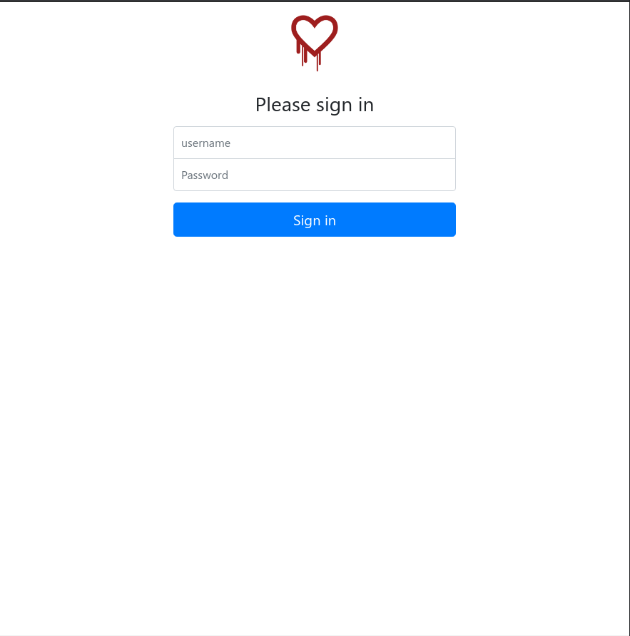
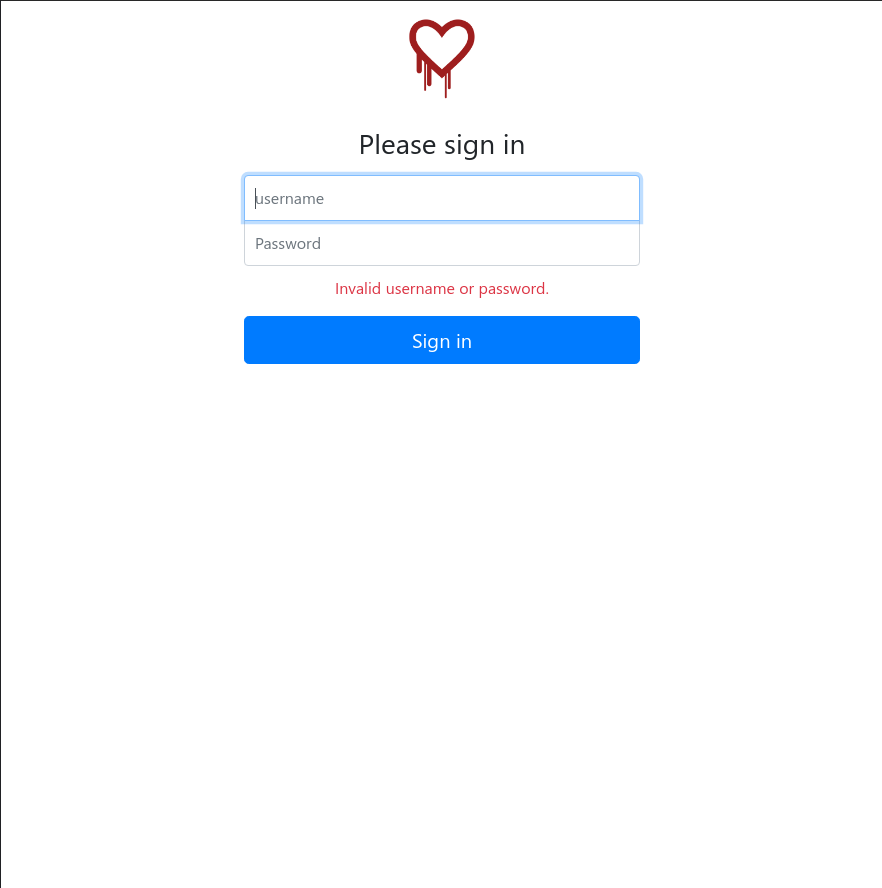
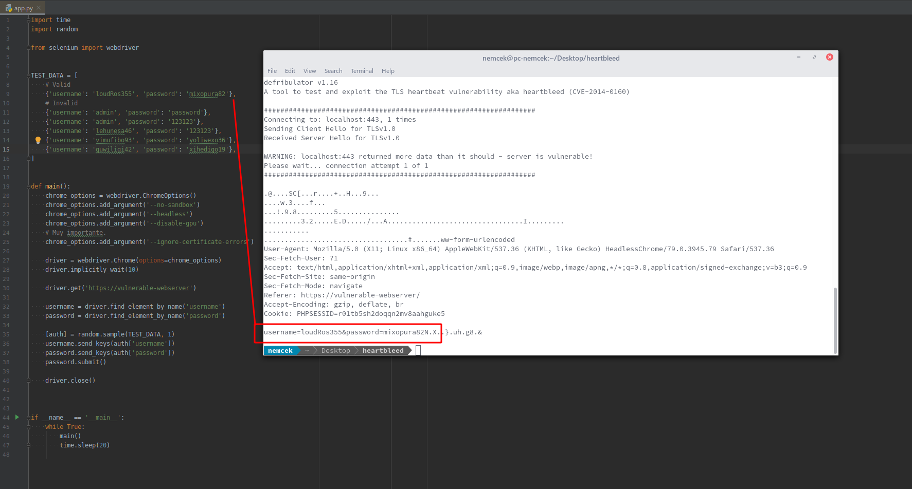

## OpenSSL Heartbleed
The Heartbleed Bug is a serious vulnerability in the popular OpenSSL cryptographic software library.
This weakness allows stealing the information protected, under normal conditions, by the SSL/TLS 
encryption used to secure the Internet. SSL/TLS provides communication security and privacy over 
the Internet for applications such as web, email, instant messaging (IM) and some virtual private 
networks (VPNs).
[[source]](https://heartbleed.com/)

### How to run?
`$ docker-compose up --build`

Starts the vulnerable web server on the port `443` -> `https://localhost:443`.
The certificate running on web server is not changed. It is self signed and it keeps complaining that
it is invalid. We can't do anything about it. 
Users should add an exception for this certificate.

The second image in the docker compose is the application that simulates the web-browser click. 
We need this to periodically send some data to the server so users are able to steal it actually.
It uses Python and the `selenium` library to create a headless browser that makes the login attempts.
I was not able to emulate the web browser in pure Python. The form data were a little different and 
it was not possible to see it in the buffer that was returned using the exploit. I suspect that the 
communication that was initiated by Python was a little different and therefore I had to employ a 
real web browser to make the login attempts.
 

### Web page
The welcome page looks like this:

When the credentials are invalid:

When the credentials are valid:

### Test script
One can run a test script to see that data the server can provide:
`$ python2 test_script/heartbleed.py localhost`

